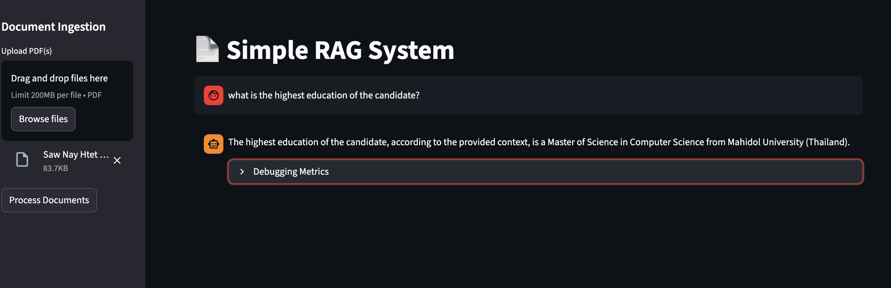

# 🧠 Local RAG System

Simeple yet production-grade Retrieval-Augmented Generation (RAG) system with local inference and zero data egress. Demonstrates MLOps best practices including container orchestration, streaming optimization, and persistent vector storage.

## 📸 Demo



## 🚀 Features

- **Microservices Architecture** — FastAPI backend + Streamlit frontend via Docker network
- **Local Inference** — CPU/Metal (M-Series) with quantized Mistral 7B via Ollama
- **Streaming Optimization** — TTFT reduced from 12s to ~1.5s
- **Data Persistence** — ChromaDB with Docker volume management
- **Observability** — Structured logging for latency tracking

## 🛠️ Stack

**Backend:** FastAPI, LangChain, Ollama (Mistral + Nomic embeddings)  
**Frontend:** Streamlit  
**Storage:** ChromaDB  
**PDF Processing:** PDFPlumber

## ⚡ Quick Start

**Prerequisites:** Docker, Ollama

```bash
git clone https://github.com/yourusername/local-rag-ops.git

cd local-rag-ops

docker compose up --build
```

**Access:**
- Frontend: http://localhost:8501
- API Docs: http://localhost:8000/docs

## 📉 Performance (M1 Pro)

- Retrieval: ~1.2s
- Generation: ~12s (streaming)
- Throughput: ~35 tokens/sec